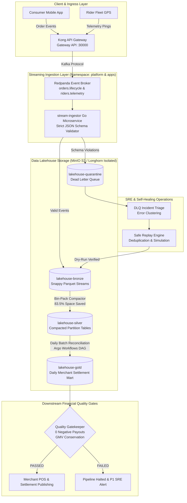

# Cloud-Native Data Platform

[](.github/workflows/)
[](contracts/schemas/)
[](docs/infra/environments.md)
[](docs/streaming/lakehouse-ingestion.md)
[](docs/observability/sre-and-monitoring.md)

> **Production-grade Cloud-Native Data Platform.**
>
> Simulates high-throughput food delivery order lifecycles, real-time courier GPS spatial telemetry, transactional outbox CDC, self-healing Dead Letter Queue (DLQ) operations, lakehouse small-file compaction, and daily merchant financial settlement with automated zero-tolerance quality gates.

---

## 🏛 Architecture & Data Flow



---

## 🌟 Key Engineering Highlights

| Capability | Implementation Detail | Business / Engineering Impact |
| :--- | :--- | :--- |
| **Strict $0.00 Cloud Cost** | Local 3-node k3s in WSL2 + AWS S3 Free Tier (5GB) + S3 Gateway Endpoint. Zero EKS fees ($73/mo avoided). | 100% production fidelity with zero operational cloud charges. |
| **Zero-Trust Network** | Default-Deny Kubernetes `NetworkPolicy` across 6 namespaces (`platform`, `apps`, `observability`, `argocd`, `argo-workflow`, `longhorn-system`). | Eliminates sidecar double-buffering overhead while ensuring strict tenant isolation. |
| **Host Storage Isolation** | Longhorn CSI configured strictly to dedicated mount `/data/k3s-storage`. | Protects Windows C: and host `/var/lib` from disk churn and storage bloat. |
| **Data Contract Gates** | Strict JSON Schema validation + backward-compatibility linter in CI + Pydantic v2 runtime models. | Guarantees breaking schema mutations are caught in CI before reaching the event broker. |
| **Transactional Outbox** | Atomic PostgreSQL outbox buffer + background relay worker in Go microservices. | Eliminates dual-write inconsistencies between relational state and Kafka topics. |
| **Autonomous DLQ Healing**| Clustering triager groups incidents by error signature; replay engine simulates remediation dry-runs. | 100% automated recovery for benign schema drift and data formatting faults. |
| **Storage SRE Compactor** | Autonomous small-file bin-packer rewrites micro-batch stream into optimized Snappy Parquet (83.5% space saved). | Resolves the Lakehouse "small file problem" without interrupting live streams. |
| **Financial Quality Gates**| Zero-tolerance pre-publish gatekeeper checks negative payouts, GMV leakage, and primary key uniqueness. | Guarantees zero erroneous payouts reach restaurant merchant partners. |

---

## 📊 Operational Web UIs & Endpoints

| Subsystem | Service | UI Endpoint | Protocol / Default Port |
| :--- | :--- | :--- | :--- |
| **Ingress Gateway** | Kong API Gateway | `http://localhost:30000/api/v1` | HTTP REST / NodePort 30000 |
| **GitOps Control Plane** | ArgoCD UI | `http://localhost:30080` | HTTP / NodePort 30080 |
| **Batch DAG Orchestrator**| Argo Workflows UI | `http://localhost:32746` | HTTP / NodePort 32746 |
| **Distributed Storage** | Longhorn Storage UI | `http://localhost:30088` | HTTP / NodePort 30088 |
| **Stream Processing** | Apache Flink Web UI | `http://localhost:38081` | HTTP / NodePort 38081 |
| **SRE Observability** | Grafana Dashboards | `http://localhost:30300` | HTTP / NodePort 30300 |
| **Distributed Tracing** | Jaeger UI | `http://localhost:31686` | HTTP / NodePort 31686 |
| **Secrets Management** | HashiCorp Vault UI | `http://localhost:38200` | HTTP / NodePort 38200 |
| **Metrics TSDB** | Prometheus | `http://localhost:9090` | HTTP / ClusterIP 9090 |
| **Log Aggregator** | Loki API | `http://localhost:3100` | HTTP / ClusterIP 3100 |

---

## 📂 Repository Layout

```text
data-platform/
├── .github/workflows/         # Domain-scoped GitHub Actions CI/CD pipelines
│   ├── ci-contracts.yaml      # Enforces data contracts and test suite
│   ├── ci-apps.yaml           # Compiles and tests Go microservices
│   ├── ci-k8s.yaml            # Validates Kubernetes & ArgoCD manifests
│   ├── ci-infra.yaml          # Validates Terraform IaC & formatting
│   └── publish-app-images.yaml# Publishes distroless images to GHCR on main merge
├── apps/                      # [Domain Workloads - Production Go Microservices]
│   ├── order-service/         # REST API + PostgreSQL Transactional Outbox
│   ├── rider-service/         # Spatial GPS Telemetry Ingestion + Outbox
│   ├── stream-ingestor/       # Redpanda Kafka Consumer + Snappy Parquet S3 Sink
│   ├── settlement-engine/     # Daily Financial Settlement & Ledger Reconciliation
│   └── traffic-generator/     # Realistic Bangkok rush-hour load simulator
├── argocd/                    # [GitOps Control Plane - Autonomous per Environment]
│   ├── dev/                   # Dev AppProjects & Applications
│   └── prod/                  # Prod AppProjects & Applications
├── contracts/                 # [Data Governance Domain - Python Self-Contained Package]
│   ├── schemas/               # Versioned JSON Schemas (orders, riders)
│   ├── models/                # Pydantic v2 typed event contracts
│   ├── tests/                 # Contract alignment unit tests
│   ├── linter.py              # Backward-compatibility CI gatekeeper
│   ├── pyproject.toml         # Autonomous package configuration
│   └── uv.lock                # Deterministic dependency lockfile
├── docs/                      # [Domain Documentation Hub]
│   ├── infra/                 # Cluster topology, host bootstrap & dual-env FinOps
│   ├── governance/            # Data contract specs & backward compatibility rules
│   ├── apps/                  # Transactional outbox & rider spatial telemetry specs
│   ├── streaming/             # Lakehouse streaming ingestion & Bronze S3 specs
│   ├── operations/            # DLQ self-healing & small-file compaction specs
│   ├── batch/                 # Batch settlement DAG & financial quality gate specs
│   └── observability/         # Observability architecture, Prometheus, Loki, Jaeger
├── infra/                     # [Platform Substrate & Cloud IaC]
│   ├── bootstrap/             # Native 3-node k3s cluster setup in WSL2
│   └── terraform/             # Substrate namespaces & Longhorn CSI (modules/ & envs/)
└── k8s/                       # [Declarative Kubernetes Manifests by Kind]
    ├── platform/              # Kong, PostgreSQL, Redpanda, MinIO, Flink, Vault
    ├── observability/         # Prometheus, Alertmanager, Loki, Jaeger, Grafana
    └── apps/                  # Workload deployment manifests & overlays
```

---

## 📚 Domain Documentation Hub

Detailed architectural specifications, mathematical formulations, and engineering deep-dives are organized in the [`docs/`](docs/) directory:

| Domain | Specification Document | Description |
| :--- | :--- | :--- |
| **Setup & Operations**| [`docs/setup/README.md`](docs/setup/README.md) | Complete end-to-end setup guide: toolchain, 3-node cluster, Terraform, Vault, and GitOps. |
| **Infrastructure** | [`docs/infra/provisioning.md`](docs/infra/provisioning.md) | 3-Node k3s topology, Longhorn CSI isolation, and resource limits profile. |
| **Infrastructure** | [`docs/infra/environments.md`](docs/infra/environments.md) | Dual-environment Terraform IaC, S3 Gateway Endpoint FinOps ($0.00 cloud fee). |
| **Governance** | [`docs/governance/data-contracts.md`](docs/governance/data-contracts.md) | Strict JSON Schemas, CI compatibility gatekeeper, and evolution rules. |
| **Workloads** | [`docs/apps/order-outbox.md`](docs/apps/order-outbox.md) | Transactional Outbox pattern in Go/PostgreSQL, eliminating dual-write hazards. |
| **Workloads** | [`docs/apps/rider-telemetry.md`](docs/apps/rider-telemetry.md) | Architectural simulation of GPS ingestion, Precision-7 geohashing, and driver state machine. |
| **Streaming** | [`docs/streaming/lakehouse-ingestion.md`](docs/streaming/lakehouse-ingestion.md) | Redpanda consumer, in-line contract validator, Snappy Parquet, and DLQ sinks. |
| **Operations** | [`docs/operations/dlq-self-healing.md`](docs/operations/dlq-self-healing.md) | Dead-letter quarantine, error clustering, and dry-run safe replay engine. |
| **Operations** | [`docs/operations/lakehouse-compaction.md`](docs/operations/lakehouse-compaction.md) | Solving the small-file problem with autonomous bin-packing (83.5% space reduction). |
| **Batch Analytics** | [`docs/batch/financial-settlement.md`](docs/batch/financial-settlement.md) | Two-sided ledger reconciliation, VAT/commission math, and zero-tolerance quality gates. |
| **Observability** | [`docs/observability/sre-and-monitoring.md`](docs/observability/sre-and-monitoring.md) | The Three Pillars (Metrics, Logs, Traces) + Alerting and SRE SLO definitions. |
| **Security** | [`docs/security/vault-secrets.md`](docs/security/vault-secrets.md) | HashiCorp Vault KV v2 secret specifications and ExternalSecrets mapping. |

---

## 🚀 Quickstart & Developer Workflow

> 📖 **Full Guide**: For complete end-to-end instructions, see the [Platform Setup & Operations Guide](docs/setup/README.md).

### Quick Setup Commands

```bash
# 1. Install all required developer tools, runtimes, and storage drivers in WSL
make install-tools

# 2. Bootstrap native 3-node k3s cluster in WSL2 (AlmaLinux-10)
make host-bootstrap

# 3. Initialize and apply local Terraform infrastructure (Longhorn CSI, ArgoCD)
make infra-init
make infra-apply

# 4. Compile autonomous Go microservices & validate Data Contracts
make build-apps
make test-contracts
make test

# 5. Display active Web UI endpoints
make dashboard
```

---
