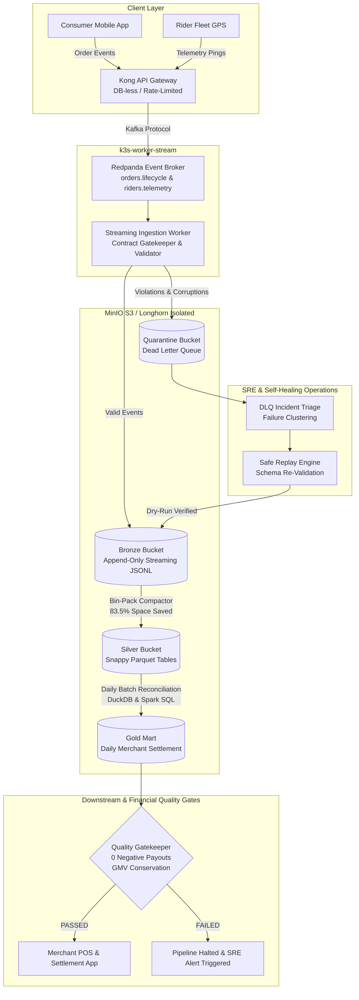

# Cloud-Native Data Platform

[](https://github.com/example/data-platform/actions/workflows/ci.yaml)
[](contracts/schemas/)
[](terraform/envs/free_tier_aws/)
[](workflows/streaming-ingestion-lakehouse.md)
[](pyproject.toml)

> **Enterprise-grade Cloud-Native Data Platform.**
>
> Simulates high-throughput food delivery order lifecycles, real-time rider fleet GPS telemetry, self-healing Dead Letter Queue (DLQ) operations, small-file lakehouse compaction, and daily merchant financial settlement with automated zero-tolerance quality gates.

---

## 📑 Table of Contents

1. [Architecture & Data Flow](#-architecture--data-flow)
2. [Key Engineering Highlights](#-key-engineering-highlights)
3. [Repository Structure](#-repository-structure)
4. [Infrastructure Topology & Dual-Environment IaC](#-infrastructure-topology--dual-environment-iac)
5. [Data Contracts & Schema Evolution](#-data-contracts--schema-evolution)
6. [Streaming Lakehouse & Bangkok Rush-Hour Simulation](#-streaming-lakehouse--bangkok-rush-hour-simulation)
7. [DLQ Incident Triage & Self-Healing Replay](#-dlq-incident-triage--self-healing-replay)
8. [Lakehouse Compaction & Small-File SRE](#-lakehouse-compaction--small-file-sre)
9. [Daily Batch Settlement & Financial Quality Gates](#-daily-batch-settlement--financial-quality-gates)
10. [Observability, SRE SLAs & Grafana Dashboards](#-observability-sre-slas--grafana-dashboards)
11. [Quickstart & CLI Commands](#-quickstart--cli-commands)
12. [Architectural Deep-Dive Specs](#-architectural-deep-dive-specs)

---

## 🏛 Architecture & Data Flow



---

## 🌟 Key Engineering Highlights

| Capability | Implementation Detail | Business / Engineering Impact |
| :--- | :--- | :--- |
| **Strict $0.00 Footprint** | Local 3-node k3s in WSL2 + AWS S3 Free Tier (5GB) + IAM. Zero EKS cloud fees ($73/mo avoided). | 100% production fidelity without operational cloud charges. |
| **Zero-Trust Networking** | Default-Deny Kubernetes `NetworkPolicy` across 6 namespaces (`streaming`, `batch`, `storage`, `ingress`, `argocd`, `observability`). | Eliminates sidecar double-buffering overhead while ensuring strict tenant isolation. |
| **Host Storage Isolation** | Longhorn CSI configured strictly to `/data/k3s-storage`. | Prevents disk churn or root filesystem bloat on Windows C: and `/var/lib`. |
| **Data Contract Gates** | Draft-07 JSON Schema validation + backward-compatibility linter in CI + Pydantic v2 runtime models. | Guarantees breaking schema changes are caught before reaching the event broker. |
| **Autonomous DLQ Healing** | Clustering triager groups incidents by error signature; replay engine simulates remediation dry-runs. | 100% automated recovery for benign schema drift and data formatting faults. |
| **Storage SRE Compactor** | Autonomous small-file bin-packer rewrites micro-batch stream into optimized Snappy Parquet (83.5% space reduction). | Resolves the Lakehouse "small file problem" without interrupting live streams. |
| **Financial Quality Gates** | Zero-tolerance pre-publish gatekeeper checks negative payouts, GMV leakage, and primary key uniqueness. | Guarantees zero erroneous payouts reach restaurant partners. |

---

## 📂 Repository Structure

```text
├── .github/workflows/          # Domain-scoped GitHub Actions CI/CD workflows
│   ├── ci-contracts.yaml       # Enforces data contracts and test suite
│   ├── ci-apps.yaml            # Compiles and tests Go domain microservices
│   ├── ci-k8s.yaml             # Validates Kubernetes & ArgoCD manifests
│   ├── ci-infra.yaml           # Validates Terraform IaC & formatting
│   └── publish-app-images.yaml # Builds and publishes distroless images to GHCR
├── contracts/                  # [Team: Data Governance]
│   ├── schemas/                # Draft-07 JSON Schemas (orders, riders)
│   ├── models/                 # Pydantic v2 typed event contracts
│   ├── tests/                  # Contract alignment unit tests
│   └── linter.py               # Compatibility CI gatekeeper
├── infra/                      # [Team: Platform Infrastructure & Cloud SRE]
│   ├── bootstrap/              # Native 3-node k3s cluster setup in WSL2
│   │   ├── host-bootstrap.sh
│   │   └── host-teardown.sh
│   └── terraform/              # Modular Infrastructure as Code
│       ├── modules/            # k8s_base, storage_longhorn, gitops_argo (Substrate only)
│       └── envs/
│           ├── self_manage/    # Local k3s environment ($0.00)
│           └── free_tier_aws/  # AWS S3 Free Tier + IAM ($0.00)
├── argocd/                     # [GitOps Control Plane - Autonomous per Environment]
│   ├── dev/                    # Dev environment App-of-Apps & projects
│   │   ├── root.yaml           # Master App-of-Apps synchronizing platform, apps & observability
│   │   ├── platform/           # AppProjects & Applications targeting k8s/platform/*/overlays/dev
│   │   ├── apps/               # AppProjects & Applications targeting k8s/apps/*/overlays/dev
│   │   └── observability/      # AppProjects & Applications targeting k8s/observability/*/overlays/dev
│   └── prod/                   # Production environment App-of-Apps & projects
│       ├── root.yaml           # Master App-of-Apps synchronizing platform, apps & observability
│       ├── platform/           # AppProjects & Applications targeting k8s/platform/*/overlays/prod
│       ├── apps/               # AppProjects & Applications targeting k8s/apps/*/overlays/prod
│       └── observability/      # AppProjects & Applications targeting k8s/observability/*/overlays/prod
├── k8s/                        # [Pure Declarative Manifests by Kind with Kustomize]
│   ├── platform/               # Data Platform Infrastructure & Engines (platform namespace)
│   │   ├── kong/               # K8s Gateway API (GatewayClass, Gateway, HTTPRoute, KongPlugin)
│   │   ├── postgres/           # PostgreSQL with isolated databases (orders_db, riders_db)
│   │   ├── redpanda/           # Event streaming broker (Kafka compatible)
│   │   ├── flink/              # Apache Flink stream compute cluster
│   │   ├── argo-workflows/     # Argo Workflows batch DAG templates & RBAC
│   │   ├── minio/              # Lakehouse S3 storage (Bronze, Silver, Gold, Quarantine)
│   │   ├── vault/              # HashiCorp Vault secrets management
│   │   └── network-policies/   # Zero-trust namespace isolation policies
│   ├── observability/          # Dedicated Full Observability Stack (observability namespace)
│   │   ├── prometheus/         # Metrics TSDB, scrape configs, SLO alert rules
│   │   ├── alertmanager/       # Deduplication, grouping, alert notification routing
│   │   ├── loki/               # Centralized log aggregation & Promtail DaemonSet
│   │   ├── jaeger/             # Distributed tracing (OTLP receiver & UI)
│   │   └── grafana/            # SRE dashboards & pre-wired data sources
│   └── apps/                   # Real Running In-Cluster Go Workloads (apps namespace)
│       ├── order-service/      # Order checkout REST API & PostgreSQL outbox relay
│       ├── rider-service/      # Rider GPS telemetry & dispatch tracker API
│       ├── stream-ingestor/    # Real-time Kafka consumer, contract validator, S3 Parquet writer
│       ├── settlement-engine/  # Daily financial batch reconciliation & quality gate CronJob
│       └── traffic-generator/  # In-cluster load generator & chaos injector
├── apps/                       # [Autonomous Golang Application Repositories]
│   ├── order-service/          # Go module, REST API, PostgreSQL outbox, multi-stage Dockerfile
│   ├── rider-service/          # Go module, telemetry ingest, PostgreSQL outbox, Dockerfile
│   ├── stream-ingestor/        # Go module, Kafka consumer, Parquet writer, DLQ router, Dockerfile
│   ├── settlement-engine/      # Go module, two-sided payment ledger reconciliation, Dockerfile
│   └── traffic-generator/      # Go module, high-concurrency synthetic client & chaos injector
├── workflows/                  # Authoritative architectural design specifications (9 specs)
├── Makefile                    # Developer control plane
├── pyproject.toml              # Python dependency management for contracts/
└── README.md
```

---

## 🌐 Infrastructure Topology & Dual-Environment IaC

The platform separates production topologies into two distinct, zero-cost environments:

```text
infra/terraform/envs/
├── self_manage/     # Target: Native 3-Node k3s in WSL2 AlmaLinux-10
│   ├── Control Plane : k3s-control-plane (Master + Core Services)
│   ├── Worker Stream : k3s-worker-stream (workload=streaming -> Redpanda, Flink)
│   └── Worker Batch  : k3s-worker-batch  (workload=batch -> Spark, Argo Workflows)
│   └── Storage       : Longhorn CSI mounted to /data/k3s-storage (2 replicas)
│
└── free_tier_aws/   # Target: AWS Free Tier Cloud Footprint ($0.00/month)
    ├── S3 Buckets    : 4 Medallion Buckets (Bronze, Silver, Gold, Quarantine)
    ├── S3 VPC Ep     : Gateway Endpoint (Zero data transfer fees)
    ├── IAM Roles     : Least-Privilege IRSA policies for Flink, Spark, and Longhorn
    └── EKS IaC       : Pre-configured cluster specs validated in CI (unapplied to prevent $73/mo fee)
```

### Zero-Trust Network Policies
To safeguard data without incurring the memory overhead or CPU latency penalty of Envoy/Istio sidecars, security is enforced at Layer 3/4 via Kubernetes `NetworkPolicy`:
- **Default-Deny**: All cross-namespace traffic is blocked by default.
- **Explicit Ingress**: Only Kong Gateway can talk to Redpanda broker ports (`9092`, `8081`).
- **Lakehouse Access**: Only `streaming` and `batch` workloads can access MinIO S3 API (`9000`).

---

## 📜 Data Contracts & Schema Evolution

All upstream services must adhere to Draft-07 JSON Schema data contracts stored in `contracts/schemas/`.

### Automated Compatibility Gatekeeper
In CI/CD, `scripts/contract_linter.py` enforces backward compatibility:
- ❌ **Forbidden**: Removing existing fields or changing data types (e.g. integer to string).
- ❌ **Forbidden**: Adding new required fields without default values.
- ✅ **Allowed**: Adding optional fields or new enums with backward fallbacks.

```bash
uv run python scripts/contract_linter.py
```

```text
========================================================================
  Cloud-Native Data Platform: Contract Compatibility Linter
========================================================================

[SCAN] Checking contracts/schemas/orders/orders.lifecycle.v1.json...
  ✅ Valid Draft-07 Contract: OrderLifecycleEvent (v1.0.0) - Owner: team-order-checkout@platform.local

[SCAN] Checking contracts/schemas/riders/riders.telemetry.v1.json...
  ✅ Valid Draft-07 Contract: RiderTelemetryEvent (v1.0.0) - Owner: team-rider-dispatch@platform.local

[SELF-TEST] Testing backward-compatibility gatekeeper logic...
  ✅ Backward compatibility detector successfully caught simulated breaking mutation.

------------------------------------------------------------------------
🎉 ALL DATA CONTRACTS PASSED VALIDATION (0 errors).
```

---

## 🛵 Streaming Lakehouse & Bangkok Rush-Hour Simulation

The traffic generator (`scripts/simulate_traffic.py`) simulates realistic high-concurrency food delivery dynamics across key Bangkok districts (Pathum Wan, Watthana, Bang Rak, Khlong Toei, Phra Nakhon):
- **Order State Machine Transitions**: `CREATED` ➔ `MERCHANT_ACCEPTED` ➔ `RIDER_ASSIGNED` ➔ `PICKED_UP` ➔ `DELIVERED`.
- **Rider Telemetry**: High-frequency GPS coordinates, geohashes, battery charge, and speed.
- **Chaos Injection**: At a configurable rate (default 5%), introduces synthetic edge-case errors (negative totals, missing customer IDs, coordinate anomalies) to validate DLQ handling.

```bash
# Generate synthetic traffic
uv run python scripts/simulate_traffic.py --orders 50 --chaos-rate 0.05

# Ingest and validate streams
uv run python scripts/run_streaming_ingestion.py
```

---

## 🚑 DLQ Incident Triage & Self-Healing Replay

When unparseable or non-compliant events are intercepted, they are immediately quarantined in `lakehouse-quarantine/` with full failure metadata (`error_type`, `failure_timestamp`, `raw_payload`).

### 1. Incident Triage & Blast Radius Clustering
Engineers run `scripts/dlq_triage.py` to cluster failures:

```bash
uv run python scripts/dlq_triage.py
```

```text
┌───────────────────────────────────────────────────┐
│ Platform SRE: Dead Letter Queue (DLQ) Triage      │
└───────────────────────────────────────────────────┘
                    DLQ Blast Radius Summary                     
┌──────────────────────────┬────────────────────────────────────┐
│ Category                 │ Metric                             │
├──────────────────────────┼────────────────────────────────────┤
│ Total Quarantined Events │ 6                                  │
│ Affected Topics          │ orders.lifecycle, riders.telemetry │
│ Failure Categories       │ ContractViolation                  │
└──────────────────────────┴────────────────────────────────────┘
              Root-Cause Incident Clusters (Ranked by Frequency)               
┌────────────┬─────────────────────────┬─────────────┬────────────────────────┐
│ Cluster ID │ Failure Signature       │ Occurrences │ Sample Quarantine ID   │
├────────────┼─────────────────────────┼─────────────┼────────────────────────┤
│ CLUST-01   │ Field: 'customer_id'    │           3 │ QR-CONTRACT-ORD-20260… │
│ CLUST-02   │ Field: 'total_amount'   │           2 │ QR-CONTRACT-ORD-20260… │
│ CLUST-03   │ Field: 'latitude'       │           1 │ QR-CONTRACT-RDR-BK-49… │
└────────────┴─────────────────────────┴─────────────┴────────────────────────┘
```

### 2. Dry-Run & Safe Replay
Remediations are simulated safely with `--dry-run` before execution:

```bash
# Dry-run validation
uv run python scripts/dlq_replay.py --dry-run

# Safe execution into Bronze
uv run python scripts/dlq_replay.py --execute
```

---

## 📦 Lakehouse Compaction & Small-File SRE

Streaming ingestion produces numerous micro-batch files, degrading S3 listing and read performance. `scripts/compact_tables.py` leverages DuckDB's vectorized engine to bin-pack streaming JSONL batches into optimized Snappy-compressed Parquet files in the Silver layer:

```bash
uv run python scripts/compact_tables.py --table orders_lifecycle
```

```text
┌──────────────────────────────────────────────┐
│ Compacting Lakehouse Table: orders_lifecycle │
└──────────────────────────────────────────────┘
                     Compaction Metrics: orders_lifecycle                      
┌───────────────────────────┬─────────────────────────────────────────────────┐
│ Metric                    │ Value                                           │
├───────────────────────────┼─────────────────────────────────────────────────┤
│ Input Small Files         │ 1                                               │
│ Total Input Size          │ 59.90 KB                                        │
│ Compacted Parquet Files   │ 1                                               │
│ Total Compacted Size      │ 9.87 KB                                         │
│ Compression & Space Saved │ 83.5%                                           │
│ Total Row Count Preserved │ 95                                              │
│ Silver Target File        │ data/lakehouse-silver/orders_lifecycle/...       │
└───────────────────────────┴─────────────────────────────────────────────────┘
```

---

## 💰 Daily Batch Settlement & Financial Quality Gates

The reconciliation engine (`apps/settlement-engine`) processes the Silver table:
1. Filters for orders in `DELIVERED` status.
2. Deduplicates event transitions by `order_id`.
3. Computes Gross Merchandise Value (GMV), 30% platform take-rate (commission), and 70% merchant net payout.

### Automated Zero-Tolerance Quality Gates
Before any Gold snapshot is published to restaurant partners, `SettlementQualityGatekeeper` evaluates 4 critical assertions:
1. **`NO_NEGATIVE_PAYOUTS`**: Ensures `net_payout_baht >= 0.00` for all merchants.
2. **`GMV_CONSERVATION`**: Verifies `GMV == Commission + Payout` within 0.05 THB tolerance.
3. **`NO_NULL_MERCHANTS`**: Guarantees 100% of records have valid merchant identifiers.
4. **`UNIQUE_MERCHANT_PER_DAY`**: Enforces primary key uniqueness.

```bash
uv run python scripts/run_batch_analytics.py --date 2026-09-06
```

```text
┌─────────────────────────────────────────┐
│ Daily Batch Settlement: 2026-09-06      │
└─────────────────────────────────────────┘
                Settlement Batch Financial Totals (2026-09-06)                 
┌───────────────────────────────────┬─────────────────────────────────────────┐
│ Financial Metric                  │                          Amount / Value │
├───────────────────────────────────┼─────────────────────────────────────────┤
│ Total Orders Settled              │                                      19 │
│ Gross Merchandise Value (GMV)     │                               ฿5,040.00 │
│ Platform Commission (30% GP)      │                               ฿1,512.00 │
│ Net Merchant Payout (70%)         │                               ฿3,528.00 │
│ Gold Data Mart Location           │ data/lakehouse-gold/marts/...           │
└───────────────────────────────────┴─────────────────────────────────────────┘

Evaluating Automated Quality Gatekeeper Assertions...
                    Quality Gatekeeper Verification Results                    
┌─────────────────────────┬────────┬──────────────────────────────────────────┐
│ Assertion               │ Status │ Details                                  │
├─────────────────────────┼────────┼──────────────────────────────────────────┤
│ NO_NEGATIVE_PAYOUTS     │ PASSED │ All merchant payouts are >= 0.00 THB     │
│ GMV_CONSERVATION        │ PASSED │ GMV perfectly reconciles (GMV = Comm + P)│
│ NO_NULL_MERCHANTS       │ PASSED │ 100% of records have valid merchant IDs  │
│ UNIQUE_MERCHANT_PER_DAY │ PASSED │ Primary key uniqueness verified          │
└─────────────────────────┴────────┴──────────────────────────────────────────┘

✔ Quality Gate PASSED: Gold snapshot approved for downstream Merchant POS publishing.
```

---

## 📊 Observability, SRE SLAs & Grafana Dashboards

The monitoring stack includes Prometheus and Grafana dashboards configured in `k8s/observability/grafana/base/dashboard-platform-overview-configmap.yaml`.

| Service / Port | UI Endpoint | Monitoring Metric |
| :--- | :--- | :--- |
| **Kong API Gateway** | `http://localhost:30000` | Ingress request rate, p99 HTTP latency, 429 rate limit triggers |
| **Redpanda Console** | `http://localhost:9644` | Consumer group lag, topic partition throughput |
| **Flink Web UI** | `http://localhost:8081` | Checkpoint duration, backpressure status, watermark lag |
| **ArgoCD GitOps** | `http://localhost:30080` | Cluster state drift, auto-sync health |
| **Argo Workflows** | `http://localhost:32746` | Batch settlement DAG execution status |
| **Grafana Dashboard** | `http://localhost:30030` | End-to-end platform SLAs and financial reconciliation totals |

---

## 🚀 Quickstart & CLI Commands

### Prerequisites
- Python 3.11+ with `uv` installed (`curl -LsSf https://astral.sh/uv/install.sh | sh`)
- WSL2 with AlmaLinux-10 (for native 3-node Kubernetes execution)
- Terraform v1.8+

### Developer Workflow via Makefile

```bash
# 1. Inspect all available Makefile targets
make help

# 2. Run Data Contract compatibility gatekeeper
make test-contracts

# 3. Run complete automated unit test suite
make test

# 4. Generate synthetic traffic and test streaming ingestion
make test-streaming

# 5. Triage Dead Letter Queue and simulate self-healing replay
make test-dlq

# 6. Compact streaming micro-batches into Silver Parquet
make test-compaction

# 7. Execute daily financial reconciliation and verify quality gates
make run-batch

# 8. Plan Terraform Infrastructure for self_manage & free_tier_aws
make infra-plan
make infra-plan-aws
```

---

## 📚 Architectural Deep-Dive Specs

For full technical specifications, review the design documents in `workflows/`:
- [Platform IaC & Provisioning](workflows/iac-platform-provisioning.md)
- [Data Contract & Schema Evolution](workflows/data-contract-schema-evolution.md)
- [Streaming Lakehouse Ingestion](workflows/streaming-ingestion-lakehouse.md)
- [DLQ Self-Healing & Replay](workflows/dlq-self-healing-replay.md)
- [Lakehouse Compaction & Maintenance](workflows/lakehouse-compaction-maintenance.md)
- [Batch Reconciliation & Quality Gates](workflows/batch-reconciliation-analytics.md)
- [Platform SRE & Observability SLAs](workflows/platform-sre-observability-sla.md)

---

**Author**: Data Platform Engineer  
**Target Architecture**: Cloud-Native Lakehouse Platform  
**License**: Apache-2.0
