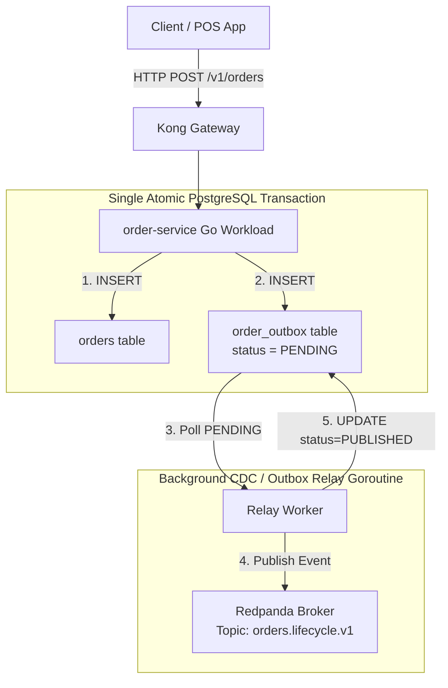

# Workloads: Order Service & Transactional Outbox Pattern

**Domain**: Autonomous Domain Engineering (`apps/order-service`)  
**Scope**: REST API, Transactional Outbox in PostgreSQL, and Zero Dual-Write Architecture  

---

## 1. Architectural Problem: The Dual-Write Hazard

In microservice architectures, updating a relational database and publishing an event to Kafka in two separate calls creates a dual-write vulnerability:
- If the database write succeeds but the network to Kafka drops, the event is lost.
- If the Kafka event is published but the database transaction rolls back, downstream systems process a "phantom" order.

The `order-service` implements the **Transactional Outbox Pattern** to ensure strict atomic consistency:



---

## 2. PostgreSQL Outbox Schema

Implemented in [`apps/order-service/schema.sql`](file:///c:/Users/x/work/data-platfrom/apps/order-service/schema.sql):

```sql
CREATE TABLE IF NOT EXISTS orders (
    order_id VARCHAR(64) PRIMARY KEY,
    customer_id VARCHAR(64) NOT NULL,
    merchant_id VARCHAR(64) NOT NULL,
    rider_id VARCHAR(64),
    status VARCHAR(32) NOT NULL,
    total_amount_thb NUMERIC(10, 2) NOT NULL,
    delivery_fee_thb NUMERIC(10, 2) NOT NULL,
    created_at TIMESTAMPTZ DEFAULT NOW(),
    updated_at TIMESTAMPTZ DEFAULT NOW()
);

CREATE TABLE IF NOT EXISTS order_outbox (
    event_id UUID PRIMARY KEY DEFAULT gen_random_uuid(),
    aggregate_id VARCHAR(64) NOT NULL,
    event_type VARCHAR(64) NOT NULL,
    payload JSONB NOT NULL,
    status VARCHAR(16) DEFAULT 'PENDING',
    retry_count INT DEFAULT 0,
    created_at TIMESTAMPTZ DEFAULT NOW(),
    published_at TIMESTAMPTZ
);

CREATE INDEX IF NOT EXISTS idx_order_outbox_pending ON order_outbox(status) WHERE status = 'PENDING';
```

---

## 3. Resilience Guarantees

- **Zero Lost Events**: If Redpanda experiences temporary downtime, the outbox records remain queued in PostgreSQL and drain immediately upon recovery.
- **At-Least-Once Delivery**: Events published with idempotency keys (`event_id`) allow downstream lakehouse consumers to deduplicate records.
- **Observability**: Exposes Prometheus metrics at `:8080/metrics` (`orders_created_total`, `outbox_drain_latency_seconds`).
