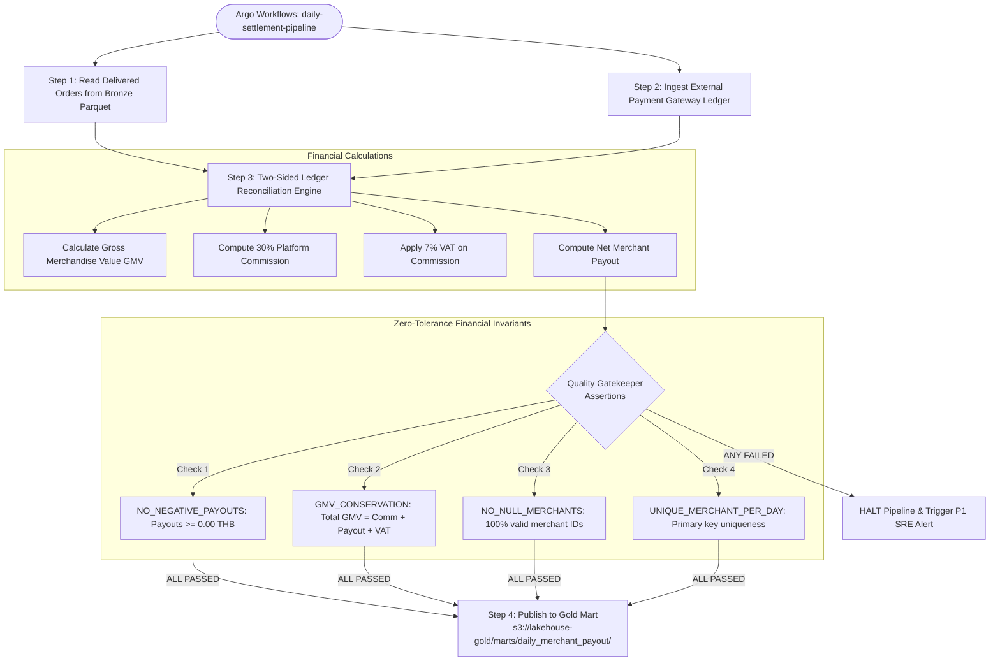

# Batch: Daily Merchant Financial Settlement & Quality Gates

**Domain**: Merchant Financial & Analytics Engineering (`apps/settlement-engine`)  
**Scope**: Two-Sided Ledger Reconciliation, Zero-Tolerance Quality Gates & Gold Mart Publishing  

---

## 1. Batch DAG Orchestration

The daily settlement pipeline executes as an Argo Workflows DAG (`argo-workflows` in namespace `argo-workflow`), performing automated two-sided financial reconciliation:



---

## 2. Financial Ledger Formulae

For each merchant $m$ on settlement date $D$:
1. **Gross Merchandise Value (GMV)**: $\sum \text{order.total\_amount}$ for all `DELIVERED` orders.
2. **Platform Commission (30%)**: $\text{GMV} \times 0.30$.
3. **VAT on Commission (7%)**: $\text{Commission} \times 0.07$.
4. **Net Merchant Payout**: $\text{GMV} - \text{Commission} - \text{VAT}$.

---

## 3. Quality Gate Output Audit Log

```text
┌─────────────────────────┬────────┬──────────────────────────────────────────┐
│ Quality Assertion Rule  │ Status │ Detail                                   │
├─────────────────────────┼────────┼──────────────────────────────────────────┤
│ NO_NEGATIVE_PAYOUTS     │ PASSED │ All merchant payouts are >= 0.00 THB     │
│ GMV_CONSERVATION        │ PASSED │ GMV perfectly reconciles (GMV = Comm + P)│
│ NO_NULL_MERCHANTS       │ PASSED │ 100% of records have valid merchant IDs  │
│ UNIQUE_MERCHANT_PER_DAY │ PASSED │ Primary key uniqueness verified          │
└─────────────────────────┴────────┴──────────────────────────────────────────┘

✔ Quality Gate PASSED: Gold snapshot approved for downstream Merchant POS publishing.
```
