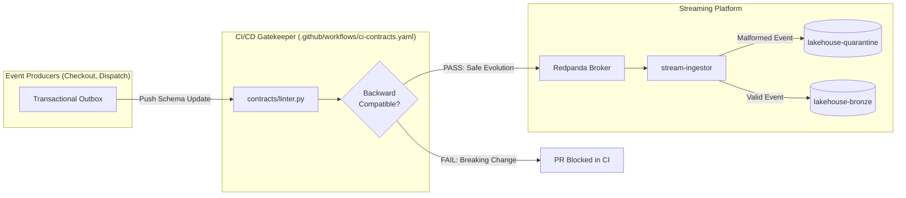

# Data Governance: Data Contracts & Schema Evolution

**Domain**: Data Governance & Data Quality (`contracts/`)  
**Scope**: Draft-07 JSON Schemas, CI Compatibility Gatekeeper & Pydantic Runtime Models  

---

## 1. Overview & Business Value

Data Contracts represent the formal, versioned contract between event producers (Order Checkout API, Rider Dispatch Service) and downstream analytical lakehouse consumers (Apache Flink, MinIO Iceberg tables, Daily Financial Settlement).

Enforcing contracts at the CI/CD boundary prevents:
- Silent breaking mutations (e.g., dropping `customer_id` or altering timestamp formats).
- Downstream ETL job failures in Flink or Spark.
- Financial reconciliation discrepancies in daily merchant settlement.



---

## 2. Canonical Contract Specification

Every contract schema in `contracts/schemas/` must adhere to the Platform Data Contract Meta-Schema:

| Requirement | Purpose | Enforcement |
| :--- | :--- | :--- |
| **`$schema`** | Declares standard `http://json-schema.org/draft-07/schema#` | Checked by CI meta-linter |
| **`title`** | Canonical event identifier (e.g., `OrderLifecycleEvent`, `RiderTelemetryEvent`) | Mandatory top-level string |
| **`metadata.domain`** | Owning business domain (`food_delivery`, `rider_fleet`, `settlement`) | Mandatory metadata object |
| **`metadata.owner_team`** | Responsible engineering team email (e.g. `team-order-checkout@platform.local`) | Regex validation in linter |
| **`metadata.version`** | Semantic version string (e.g., `1.0.0`) | SemVer matching |
| **`metadata.sla_freshness_seconds`** | Maximum acceptable end-to-end event delay (e.g., `60`) | Positive integer |

---

## 3. Backward-Compatibility Enforcement Rules

The compatibility checker in [`contracts/linter.py`](file:///c:/Users/x/work/data-platfrom/contracts/linter.py) guarantees the following invariants:

1. **No Field Removals**: Existing fields in `properties` cannot be deleted in minor or patch releases.
2. **No Field Type Changes**: An existing field type (e.g. `string` ➔ `integer`) cannot be altered.
3. **Additive Optional Fields Only**: New properties must either not be in `required` or must supply a `default`.
4. **Enum Safety**: Existing enum variants (e.g. `OrderStatus: [CREATED, MERCHANT_ACCEPTED, ...]`) cannot be deleted or renamed.

---

## 4. Local Execution & Validation

```bash
# Run schema linter and backward compatibility self-test
cd contracts && uv run python linter.py

# Run contract test suite
cd contracts && uv run --extra dev pytest -v tests
```
