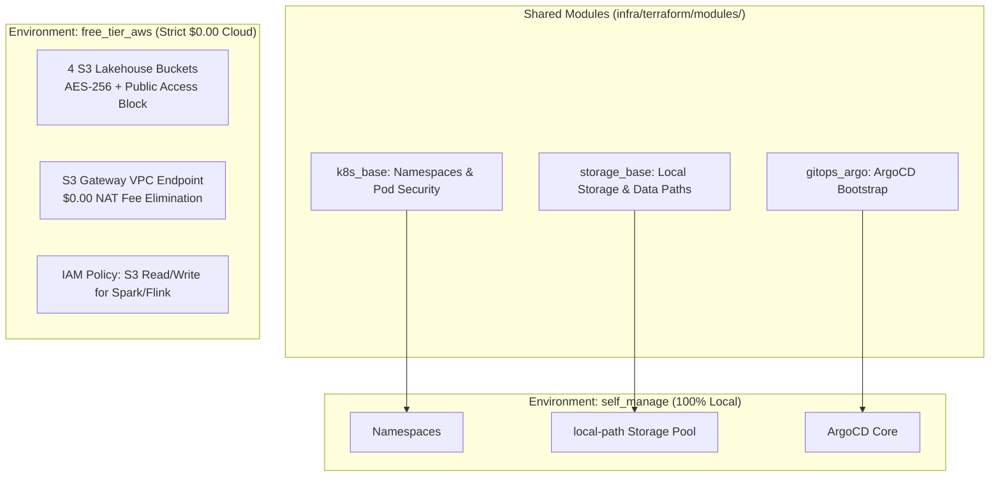

# Infrastructure: Dual-Environment Terraform IaC & FinOps

**Domain**: Platform Infrastructure & Cloud SRE (`infra/terraform/`)  
**Scope**: Dual-Target Provisioning (Local Self-Manage vs. Strict $0.00 AWS Free Tier)  

---

## 1. Environment Architecture Comparison

The Terraform infrastructure is partitioned into two distinct environments sharing common modules:



---

## 2. Cloud FinOps: Strict $0.00 AWS Free Tier Guarantee

The `free_tier_aws` environment demonstrates production-grade enterprise cloud architecture while remaining **100% within the AWS Free Tier**:

| Resource | Implementation Detail | FinOps Justification |
| :--- | :--- | :--- |
| **S3 Buckets** | 4 Medallion Buckets (`data-platform-bronze`, `silver`, `gold`, `quarantine`) with AES-256 server-side encryption | Free Tier covers 5 GB standard S3 storage, 20,000 GET, and 2,000 PUT requests/month ($0.00). |
| **S3 Gateway Endpoint** | `com.amazonaws.<region>.s3` Gateway VPC Endpoint | **Zero-Cost Data Transfer**: Eliminates AWS NAT Gateway hourly fees ($32.40/month) and data processing fees ($0.045/GB). |
| **IAM IRSA Policies** | Least-privilege IAM policy scoping S3 read/write permissions to specific medallion buckets | No cloud charge for IAM roles or policies. |
| **Zero EKS Overhead** | Kubernetes compute runs natively in local single-node k3s cluster | Eliminates the mandatory AWS EKS cluster fee ($73.00/month per cluster). |

---

## 3. Terraform Operations & Validation

```bash
# Initialize and plan self_manage environment
make infra-init
make infra-plan

# Plan AWS Free Tier environment
make infra-plan-aws
```
