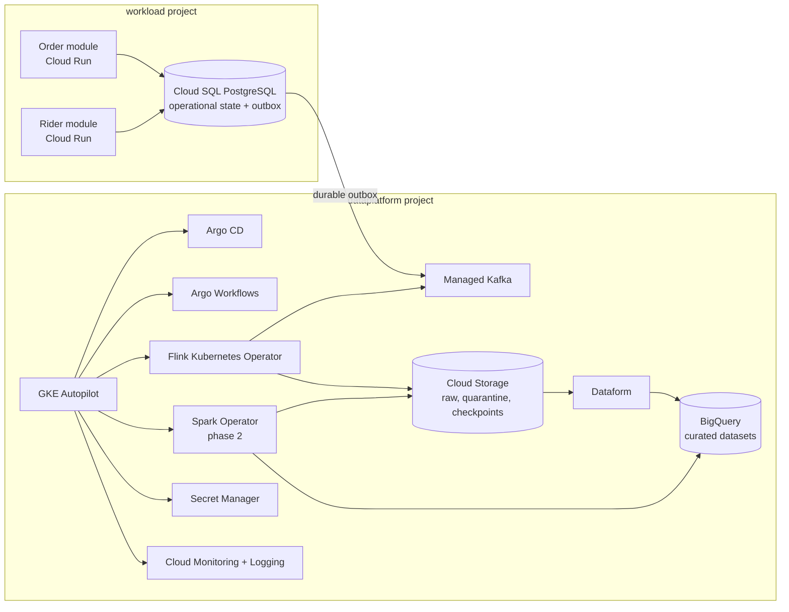

# GCP Data Platform Refactor Plan

## Outcome

Build a portfolio-grade Delivery Marketplace Data Platform on GCP. The Product remains deliberately small: it emits Order Lifecycle and Rider Telemetry data. The Data Platform is the product: it accepts, validates, processes, observes, replays, and serves that data.

The target is fully cloud-hosted. GKE Autopilot supplies Kubernetes for selected processing modules; GCP retains ownership of durable state, broker infrastructure, secrets, and observability.

## Fixed scope

- Two standalone GCP projects linked to one billing account. A personal GCP account without an Organization cannot use folders, Organization policies, or Shared VPC as the design foundation.
- `workload` owns the small producer modules and their operational database.
- `dataplatform` owns the event, processing, history, quality, and consumption modules.
- One GKE Autopilot cluster lives in `dataplatform`; there is no local Kubernetes target.
- No Kong, Vault, Redpanda, MinIO, self-managed PostgreSQL, Prometheus, Loki, or host bootstrap implementation in the target.
- The initial platform has one region and a documented recovery procedure. Multi-region active-active is outside this plan.
- The selected region is Singapore (`asia-southeast1`). It must remain the primary region for GKE, Managed Kafka, Cloud SQL, and regional Cloud Storage.
- The POC uses synthetic data only. The target network posture is private-only; no data-plane endpoint may be publicly reachable.
- The existing billing-account-wide `billing-cap` is the sole cost alert. It is not a spend cap, so billable resource apply still requires deliberate review.

## Target topology



## Module seams

| Module | External interface | Implementation responsibility |
|---|---|---|
| Product publisher | Publish a versioned Lifecycle Event or Rider Telemetry record | Cloud SQL transaction, outbox retry, Kafka authentication, producer metrics |
| Event intake | Consume valid records from a named topic | Contract validation, idempotency by `event_id`, partitioning, quarantine routing, lineage |
| Streaming processing | Produce a curated stream from a contract version | Flink job lifecycle, checkpoints, savepoints, late data, recovery |
| Batch processing | Materialize a named dataset for a business date | Spark job lifecycle, retry, data quality gate, backfill |
| Data consumption | Read a published curated dataset | BigQuery views, settlement publication state, access control |
| Platform operations | Deploy or operate a declared module | GitOps sync, workflow execution, dashboards, alerts, runbooks |

The interface is the test surface. Product publishers never learn broker topology, bucket paths, processor configuration, or platform credentials. The deletion test for each module is: removing it must force its hidden complexity back into every caller; otherwise it is shallow and should not exist.

## Desired repository layout

The local, AWS, and k3s implementation has been removed. The repository now retains only the GCP Terraform roots, event contracts, and the two publisher modules that will move to Cloud Run.

```text
workload/
  apps/
    order/
    rider/
  terraform/
    foundation/                    # workload products, plan identity, independent state
    network/                       # private Cloud Run egress subnet
    cloud-run/                      # internal-only publisher deployments
    cloud-sql/                      # private PostgreSQL + IAM database users
    artifact-registry/              # publisher images
  contracts/                       # producer-facing contract fixtures only

dataplatform/
  terraform/
    foundation/                    # project labels, enabled products, IAM, GCS state
    managed-data/                  # GCS and BigQuery
    managed-kafka/                 # broker, topics, ACLs, client-network permission
    gke/                           # Autopilot cluster and Workload Identity bindings
  gitops/
    bootstrap/                     # Argo CD installation
    modules/                       # Argo Workflows, Flink, Spark declarations
  processors/
    flink/
    spark/
  transformations/
    dataform/
  operations/
    dashboards/
    runbooks/

contracts/                         # canonical, versioned data contracts
docs/
  infra/gcp-refactor-plan.md
```

## Delivery phases

### Phase 0 — lock the contracts and operating invariants

1. Preserve existing v1 contracts as immutable. Publish v2 contracts that add `schema_version` and `producer`; every record retains a stable `event_id`.
2. Define event-time, ordering-key, duplicate, invalid-record, and replay invariants in `docs/governance/`.
3. Add contract compatibility tests to CI. The tests must reject a breaking field change and accept a compatible additive change.
4. Define platform SLOs: intake freshness, Kafka consumer lag, quarantine rate, job success, and settlement publication freshness.

**Exit:** a contract fixture can pass compatibility checks; an invalid fixture produces a named Quarantine Record expectation.

### Phase 1 — create the GCP foundation

1. Create and link two standalone projects: `<prefix>-workload` and `<prefix>-dataplatform`.
2. Bootstrap a versioned GCS Terraform-state bucket in each project; each root uses only its owning project's remote state rather than local state.
3. Enable only required GCP products and label every resource with `system=delivery-data-platform`, `environment=poc`, and `owner=<owner>`.
4. Configure project-level IAM and separate plan-only identities. The existing billing-account-wide `billing-cap` remains the cost alert. The GitHub OIDC pool lives in `dataplatform`; the `workload` identity references it only through a repository-scoped impersonation binding.
5. Run a cross-project connectivity spike: a `workload` identity must reach only its intended Managed Kafka topics in `dataplatform`.

**Exit:** Terraform can plan both project roots from remote state; the connectivity spike is logged and repeatable in CI.

### Phase 2 — establish the managed data foundation

The `dataplatform/terraform/managed-data` root now declares the private Cloud Storage zones and empty BigQuery datasets. It must be applied and verified before adding runtime resources.

1. Provision Managed Kafka topics, ACLs, consumer groups, retention, and topic-level producer identities.
2. Provision Cloud Storage buckets for raw, quarantine, Flink checkpoints/savepoints, and Spark artifacts. Set lifecycle and retention policies.
3. Provision BigQuery datasets for staging, curated, and operations; grant readers access through views rather than broad dataset roles.
4. Provision Secret Manager entries. Bind GKE Kubernetes ServiceAccounts through Workload Identity; do not sync long-lived credentials into Kubernetes Secrets.
5. Provision GKE Autopilot in `dataplatform` and direct cluster logs and metrics to Cloud Monitoring.

**Exit:** no target data is stored in a Kubernetes persistent volume; every GKE module authenticates without a service-account key.

### Phase 3 — deploy the platform control and processing modules

1. Install Argo CD as the GitOps module and have it reconcile the platform declarations from this repository.
2. Install Argo Workflows for controlled replay, backfill, and scheduled platform operations.
3. Deploy the Flink Kubernetes Operator and one Order Lifecycle processing job. Store checkpoints and savepoints in Cloud Storage.
4. Implement the Event Intake module: validate contract, reject invalid records to quarantine, make valid writes idempotent, and emit processing metrics.
5. Add a replay workflow: an operator chooses a Quarantine Record set, validates the intended contract version, and replays with a new auditable operation id.

**Exit:** inject a malformed event, observe it in quarantine, correct it through a controlled fixture, replay it, and prove exactly one curated result.

### Phase 4 — add batch, quality, and consumption

1. Add Dataform transformations for curated Order, Rider Telemetry, and Merchant Daily Settlement datasets.
2. Add the Spark Operator only when a batch workload needs distributed execution beyond BigQuery/Dataform. Start with one daily compaction or historical backfill job.
3. Add settlement assertions: no negative payout, one payout per merchant/date, GMV conservation, and source freshness.
4. Publish curated views and a small merchant settlement endpoint or dashboard.

**Exit:** a full business date can be reprocessed from raw history, and failed quality assertions prevent settlement publication.

### Phase 5 — migrate the simple product modules

1. Move Order and Rider modules to internal-only Cloud Run in `workload`, with Direct VPC egress to the private Workload subnet.
2. Replace in-memory maps with Cloud SQL operational state and the transactional outbox. The modules use IAM database authentication and no database password.
3. Configure the cross-project Managed Kafka client subnet, per-topic ACLs, and short-lived access-token Kafka authentication for the publisher identities.
4. Keep the product surface limited to Order creation/status and Rider Telemetry. Each emitted payload conforms to its canonical v2 contract and uses a stable UUID `event_id` for downstream deduplication.

**Exit:** a product action creates a durable row, publishes exactly one logical event despite retry, and appears in the curated dataset within the intake SLO.

### Legacy cleanup — complete

The local infrastructure, host bootstrap scripts, Kubernetes manifests, GitOps declarations, self-managed processors, and their deployment workflows have been removed. The repository now contains no executable legacy platform configuration.

## Demonstration scenarios

The portfolio README and a short demo recording should show four scenarios:

1. A valid Order Lifecycle event flows from the minimal product through Kafka, Flink, raw storage, and BigQuery.
2. A contract violation routes to quarantine with reason, source topic, and operation metadata.
3. A controlled replay fixes the dataset without duplicate output.
4. A delayed processor triggers a freshness or consumer-lag alert and links to its runbook.

These scenarios demonstrate streaming, batch, fault tolerance, data modeling, Kubernetes, Docker, CI/CD, monitoring, logging, and an SRE mindset without turning the product simulation into the main project.

## Deferred by design

- Multi-region active-active processing
- Kong, API management catalog, custom domain, and public developer portal
- HCP Vault, PKI, and dynamic credential leasing
- Self-managed Kafka, PostgreSQL, object storage, metrics, logs, or dashboards
- Trino, Superset, and additional data engines before a real consumer requires them
