# Infrastructure: Cluster Topology, Host Bootstrap & Storage Isolation

**Domain**: Platform Infrastructure & Cloud SRE (`infra/`)  
**Scope**: Single-Node k3s Kubernetes in WSL2, Dedicated local-path Storage, and Resource Profiles  

---

## 1. Architecture & Node Topology

The platform runs on a resource-optimized, single-node Kubernetes cluster directly inside WSL2 (`AlmaLinux-10`) using systemd. This provides full production Kubernetes fidelity with minimal RAM overhead (~1.1 GiB baseline):

```mermaid
flowchart TD
    subgraph Host["WSL2 Host (AlmaLinux-10)"]
        subgraph Node["k3s-node (control-plane + streaming + batch)"]
            K8S_API[K8s API Server :6443]
            ARGO_CD[ArgoCD GitOps Control Plane :30080 / :30443]
            ARGO_WF[Argo Workflows Controller :32746]
            KONG[Kong API Gateway :30000]
            RP[Redpanda Kafka Broker]
            FLINK[Apache Flink Stream Processor :38081]
            MINIO[MinIO 3-Tier Lakehouse :9000]
            SETTLE[settlement-engine CronJob]
            VAULT[HashiCorp Vault :38200]
            PROM[Prometheus :9090]
            GRAF[Grafana :30300]
        end

        STORAGE[(Dedicated Storage Pool: /data/k3s-storage<br/>local-path-provisioner)]
        Node -.->|Direct Host Mounts| STORAGE
    end
```



### 1.1 Node Roles & Workload Labels
All platform workloads schedule onto the unified node `k3s-node`, which is labeled with all required roles:
- `node-role.kubernetes.io/control-plane="true"`
- `node-role.kubernetes.io/master="true"`
- `node-role.kubernetes.io/worker="worker"`
- `node-role.kubernetes.io/streaming="streaming"`
- `node-role.kubernetes.io/batch="batch"`
- `workload="single-node"`

All existing `nodeSelector` declarations (e.g. Vault requiring `control-plane`) continue to match and schedule cleanly.

### 1.2 Canonical Namespace Separation
- **`platform`**: Data plane infrastructure engines (Kong, PostgreSQL, Redpanda, MinIO, Flink).
- **`vault-system`**: HashiCorp Vault security operator and auto-unsealed Vault StatefulSet.
- **`external-secrets`**: External Secrets Operator synchronizing credentials from Vault into native K8s Secrets.
- **`apps`**: Autonomous Go microservices (order-service, rider-service, stream-ingestor, settlement-engine, traffic-generator).
- **`observability`**: SRE monitoring stack (Prometheus, Alertmanager, Grafana).
- **`argocd`**: GitOps controller and App-of-Apps synchronization engine.
- **`argo-workflow`**: Batch DAG execution engine and UI.

---

## 2. Storage Management & Isolation (local-path provisioner)

Storage is provisioned by k3s built-in `local-path-provisioner` mapped to a dedicated host mount to prevent disk bloat:
- **Provisioner**: `rancher.io/local-path`
- **Host Storage Path**: `/data/k3s-storage` (configured via `local-path-config` ConfigMap)
- **StorageClass**: `local-path` (cluster default)
- **Performance**: Direct host filesystem mount (native SSD I/O, zero virtualization or iSCSI overhead)

---

## 3. Resource Limits Profile (~1.1 GB RAM Baseline)

| Component | Subsystem | CPU Limit | Memory Limit | PVC Size | Target Node | Lifecycle |
| :--- | :--- | :--- | :--- | :--- | :--- | :--- |
| **Kong Gateway** | API Ingress Proxy | 200m | 250Mi | None (DB-less) | `k3s-node` | Continuous |
| **Redpanda** | Kafka Streaming Broker | 500m | 512Mi | 2Gi (`local-path`) | `k3s-node` | Continuous |
| **PostgreSQL** | App DB & Transactional Outbox | 250m | 256Mi | 1Gi (`local-path`) | `k3s-node` | Continuous |
| **MinIO** | S3 Medallion Lakehouse Storage | 300m | 384Mi | 3Gi (`local-path`) | `k3s-node` | Continuous |
| **Flink JobManager** | Stream Orchestrator | 250m | 384Mi | None | `k3s-node` | Continuous |
| **Flink TaskManager**| Stream Processing Worker | 500m | 512Mi | None | `k3s-node` | Continuous |
| **ArgoCD Core** | GitOps Reconciler | 250m | 256Mi | None | `k3s-node` | Continuous |
| **Argo Workflows** | Batch DAG Controller | 200m | 200Mi | None | `k3s-node` | Continuous |
| **Vault** | Secrets Management | 200m | 192Mi | 500Mi (`local-path`) | `k3s-node` | Continuous |
| **Prometheus** | SRE Metrics TSDB | 250m | 384Mi | 2Gi (`local-path`) | `k3s-node` | Continuous |
| **Alertmanager** | Alert Routing Engine | 100m | 128Mi | None | `k3s-node` | Continuous |
| **Grafana** | Visualization & Dashboards | 150m | 192Mi | None | `k3s-node` | Continuous |

---

## 4. Host Bootstrap Commands

```bash
# Bootstrap single-node cluster and local storage in WSL2
make host-bootstrap

# Cleanly teardown cluster, services, and state mounts
make host-teardown
```
