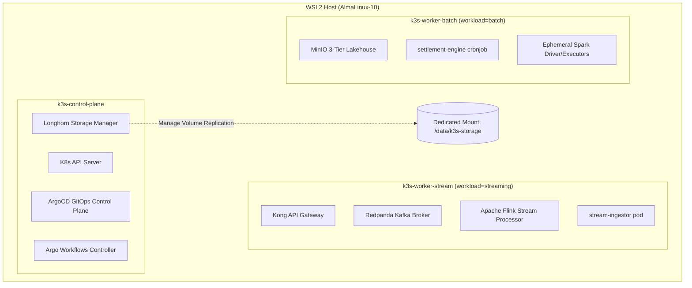

# Infrastructure: Cluster Topology, Host Bootstrap & Storage Isolation

**Domain**: Platform Infrastructure & Cloud SRE (`infra/`)  
**Scope**: 3-Node k3s Kubernetes in WSL2, Longhorn Distributed CSI, and Resource Profiles  

---

## 1. Architecture & Node Topology

The platform runs on a native 3-node Kubernetes cluster directly inside WSL2 (`AlmaLinux-10`) using systemd. This eliminates Docker-in-Docker translation layers and provides 100% production fidelity.



### 1.1 Node Roles & Labels
- **`k3s-control-plane`**:
  - Control plane components, ArgoCD Core, Argo Workflows Controller, Prometheus, Grafana, Longhorn Manager.
- **`k3s-worker-stream`** (Label: `workload=streaming`):
  - Kong API Gateway, Redpanda Kafka Broker, Apache Flink Session Cluster, stream-ingestor microservice.
- **`k3s-worker-batch`** (Label: `workload=batch`):
  - MinIO 3-Tier Medallion Lakehouse, settlement-engine batch DAGs, ephemeral Apache Spark drivers.

### 1.2 Canonical Namespace Separation
- **`platform`**: Data plane infrastructure engines (Kong, PostgreSQL, Redpanda, MinIO, Flink, HashiCorp Vault).
- **`apps`**: Autonomous Go microservices (order-service, rider-service, stream-ingestor, settlement-engine, traffic-generator).
- **`observability`**: Dedicated monitoring, logging, and tracing stack (Prometheus, Alertmanager, Loki, Jaeger, Grafana).
- **`argocd`**: GitOps controller and App-of-Apps synchronization engine.
- **`argo-workflow`**: Batch DAG execution engine and UI.
- **`longhorn-system`**: Distributed storage CSI controller, volume replicas, and UI.

---

## 2. Storage Management & Isolation (k3s Built-in local-path)

To protect the host root filesystem (`/` and `/var/lib`) from disk bloat while keeping resource usage minimal (~15 MiB RAM, 1 pod), storage is provisioned by k3s built-in `local-path-provisioner` mapped to a dedicated host mount:
- **Provisioner**: `rancher.io/local-path`
- **Isolated Storage Path**: Configured strictly to `/data/k3s-storage` via `local-path-config`.
- **StorageClass**: `local-path` (set as cluster default). An alias `longhorn-isolated` is also maintained for backwards compatibility.
- **Performance**: Direct host filesystem mount (near-native SSD speed, zero virtualization or iSCSI overhead).

---

## 3. Continuous Resource Limits Profile (< 2.2 GB RAM Baseline)

| Component | Subsystem | CPU Limit | Memory Limit | PVC Size | Target Node | Lifecycle |
| :--- | :--- | :--- | :--- | :--- | :--- | :--- |
| **Kong Gateway** | API Ingress Proxy | 200m | 250Mi | None (DB-less) | `k3s-worker-stream` | Continuous |
| **Redpanda** | Kafka Streaming Broker | 500m | 512Mi | 2Gi (`local-path`) | `k3s-worker-stream` | Continuous |
| **PostgreSQL** | App DB & Transactional Outbox | 250m | 256Mi | 1Gi (`local-path`) | `k3s-control-plane` | Continuous |
| **MinIO** | S3 Medallion Lakehouse Storage | 300m | 384Mi | 3Gi (`local-path`) | `k3s-worker-batch` | Continuous |
| **Flink JobManager** | Stream Orchestrator | 250m | 384Mi | None | `k3s-worker-stream` | Continuous |
| **Flink TaskManager**| Stream Processing Worker | 500m | 512Mi | None | `k3s-worker-stream` | Continuous |
| **ArgoCD Core** | GitOps Reconciler | 250m | 256Mi | None | `k3s-control-plane` | Continuous |
| **Argo Workflows** | Batch DAG Controller | 200m | 200Mi | None | `k3s-control-plane` | Continuous |
| **Vault** | Secrets Management | 200m | 192Mi | 500Mi (`local-path`) | `k3s-control-plane` | Continuous |
| **Prometheus** | SRE Metrics TSDB | 250m | 384Mi | 2Gi (`local-path`) | `k3s-control-plane` | Continuous |
| **Loki** | Log Aggregation Engine | 200m | 256Mi | 1Gi (`local-path`) | `k3s-control-plane` | Continuous |
| **Jaeger** | Distributed Tracing Backend | 150m | 192Mi | None (in-memory) | `k3s-control-plane` | Continuous |
| **Grafana** | Visualization & Dashboards | 150m | 192Mi | None | `k3s-control-plane` | Continuous |

---

## 4. Host Bootstrap Commands

```bash
# Bootstrap 3-node cluster and isolated storage in WSL2
make host-bootstrap

# Teardown cluster and clean up mount points
make host-teardown
```
