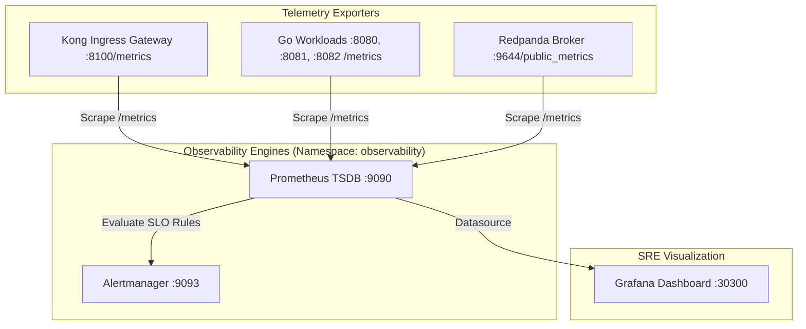

# Observability: Full Stack Telemetry & SRE SLOs

**Domain**: Platform SRE & Observability (`k8s/observability/`, `argocd/*/observability/`)  
**Scope**: Production Metrics, Alerting Rules, SLOs, and SRE Dashboards  

---

## 1. Observability Architecture

The observability stack runs as a lightweight, memory-efficient monitoring engine in namespace `observability`:

---

## 2. Concrete Service Level Objectives (SLOs)

| Objective | Metric Indicator | Target SLA | Severity |
| :--- | :--- | :--- | :--- |
| **Data Freshness** | `histogram_quantile(0.95, sum(rate(pipeline_e2e_latency_seconds_bucket[5m])) by (le))` | **p95 < 30 seconds** | Warning |
| **Consumer Lag** | `redpanda_consumer_lag_records{group="stream-ingestor-group"}` | **< 500 records** for > 3m | Warning |
| **Pipeline Reliability**| `rate(pipeline_dlq_events_total[5m]) / rate(pipeline_events_total[5m])` | **< 0.5% DLQ rate** | Critical |
| **Worker Liveness** | `up{job="stream-ingestor"}` | **== 1** | Critical |
| **Storage Hygiene** | `lakehouse_uncompacted_small_files_count` | **< 30 files** per partition | Warning |

---

## 3. Operational Web UIs & Endpoints

| Component | UI / Endpoint | Default Port | Protocol | Purpose |
| :--- | :--- | :--- | :--- | :--- |
| **Grafana** | `http://localhost:30300` | 30300 (NodePort) | HTTP UI | SRE metrics, operational dashboards, and SLO monitoring |
| **Prometheus TSDB**| `http://localhost:9090` | 9090 (ClusterIP) | HTTP Web | Raw TSDB queries, scrape targets, and alert evaluation |
| **Alertmanager** | `http://localhost:9093` | 9093 (ClusterIP) | HTTP Web | Notification routing and alert deduplication |
