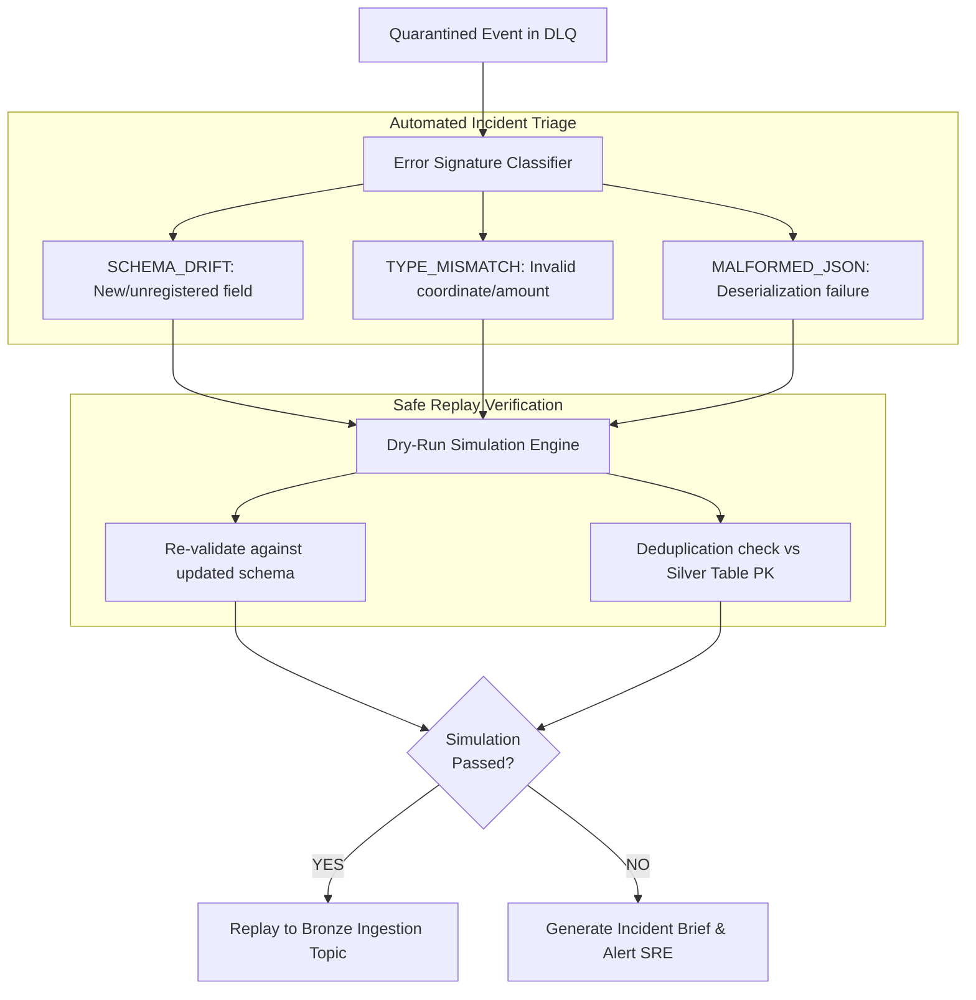

# Operations: DLQ Incident Triage & Self-Healing Replay Engine

**Domain**: Platform Reliability & Self-Healing SRE  
**Scope**: Dead-Letter Quarantine, Error Clustering, Dry-Run Validation & Safe Replay  

---

## 1. Autonomous Self-Healing Lifecycle

When messages breach data contracts or fail JSON deserialization, they are quarantined to `dead.letter.queue` in Redpanda and partitioned in MinIO `s3://lakehouse-quarantine/`:



---

## 2. Quarantine Envelope Specification

Every quarantined message is wrapped in an audit envelope:

```json
{
  "quarantine_id": "dlq-20260907-00124",
  "source_topic": "orders.lifecycle.v1",
  "error_type": "SCHEMA_VIOLATION",
  "error_message": "Required field 'customer_id' is missing",
  "quarantine_timestamp": "2026-09-07T00:15:30Z",
  "retry_count": 0,
  "raw_payload": "{\"order_id\": \"ORD-9912\"}"
}
```

---

## 3. Replay Safeguards

1. **Deduplication Check**: Before replaying any quarantined order or rider ping, the engine queries the Silver table primary key (`order_id`, `event_id`) to ensure duplicate events are not re-ingested.
2. **Simulation Mode**: A dry run produces a detailed diff showing how many events would succeed or fail before writing any live data back to Redpanda.
