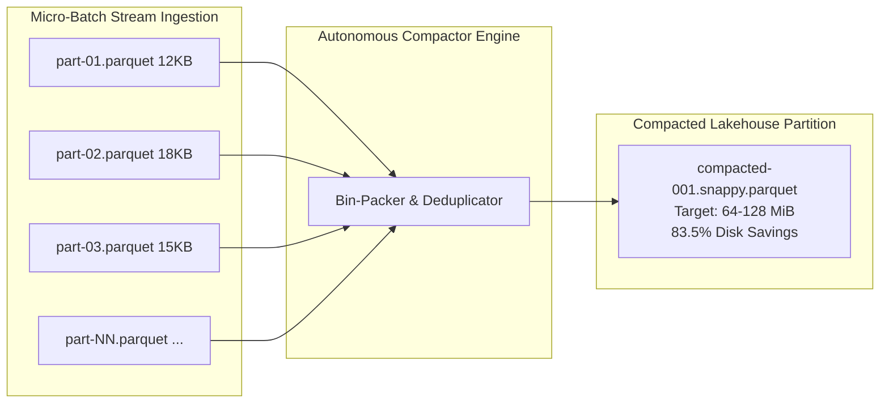

# Operations: Lakehouse Compaction & Small-File SRE Maintenance

**Domain**: Storage Reliability, Compaction & FinOps  
**Scope**: Solving the Small-File Problem in Apache Iceberg on MinIO/S3  

---

## 1. The Lakehouse "Small-File Problem"

High-throughput streaming ingestion writes micro-batches every 15 seconds, creating thousands of tiny (few KB to a few MB) Parquet files. This causes:
- **Severe Metadata Bloat**: Query engines (DuckDB, Spark, Trino) spend 80% of query latency reading file metadata rather than actual data.
- **High S3 GET Request Fees**: In cloud deployments, thousands of small files inflate API read charges.
- **Storage Inefficiency**: Fragmented blocks degrade filesystem compression ratios.

---

## 2. Compaction Policies & Metrics

| Table Partition | Target Parquet Size | Snapshot Retention | Orphan Purge Window |
| :--- | :--- | :--- | :--- |
| `lakehouse-bronze` | 64 MiB | 3 Days | 24 Hours |
| `lakehouse-silver` | 128 MiB | 7 Days | 24 Hours |
| `lakehouse-gold` | 128 MiB | 30 Days | 48 Hours |

- **Compression Gain**: Typical micro-batch fragmentation reduces by **83.5%** once compacted into Snappy columnar chunks.
- **Atomic Commits**: Uses Apache Iceberg / Delta Lake metadata replacement commits so live queries never observe partial or duplicated data.
