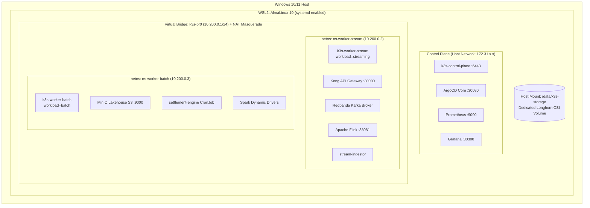
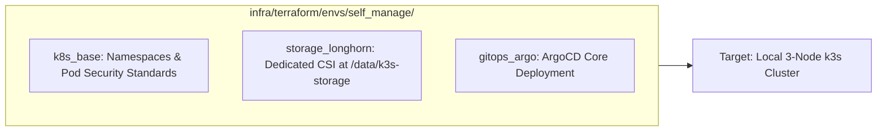
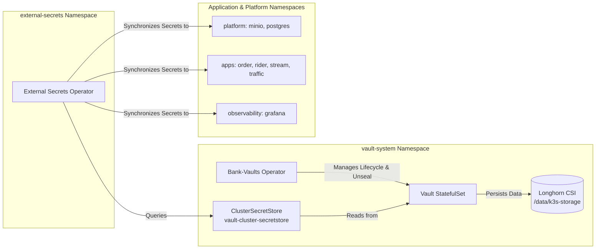

# Cloud-Native Data Platform: End-to-End Setup & Operations Guide

**Domain**: Platform Infrastructure, Engineering Operations & Developer Experience (`docs/setup/`)  
**Scope**: Complete From-Scratch Provisioning, Toolchain Automation, Native 3-Node k3s Cluster in WSL2, Terraform Substrate, HashiCorp Vault Secrets, and GitOps ArgoCD Synchronization.

---

## 📋 Table of Contents

1. [Architecture & System Prerequisites](#1-architecture--system-prerequisites)
2. [Step 1: Automated Toolchain & Dependency Installation](#2-step-1-automated-toolchain--dependency-installation)
3. [Step 2: Native 3-Node k3s Cluster Bootstrap](#3-step-2-native-3-node-k3s-cluster-bootstrap)
4. [Step 3: Platform Substrate Provisioning (Terraform IaC)](#4-step-3-platform-substrate-provisioning-terraform-iac)
5. [Step 4: Deploy HashiCorp Vault & Security Operators](#5-step-4-deploy-hashicorp-vault--security-operators)
6. [Step 5: Seed Platform Runtime Secrets into Vault](#6-step-5-seed-platform-runtime-secrets-into-vault)
7. [Step 6: Autonomous Microservices Compilation & Contract Linting](#7-step-6-autonomous-microservices-compilation--contract-linting)
8. [Step 7: GitOps Application Bootstrap (ArgoCD App-of-Apps)](#8-step-7-gitops-application-bootstrap-argocd-app-of-apps)
9. [Step 8: Verification, Testing & Operational Web UIs](#9-step-8-verification-testing--operational-web-uis)
10. [Step 9: Clean Cluster Teardown & Reset](#10-step-9-clean-cluster-teardown--reset)
11. [Troubleshooting & SRE Runbooks](#11-troubleshooting--sre-runbooks)

---

## 1. Architecture & System Prerequisites

The platform executes entirely within a native 3-node Kubernetes cluster hosted inside **WSL2 (AlmaLinux-10)** on Windows, providing 100% production fidelity with strict zero Docker-in-Docker overhead and a **$0.00 cloud cost guarantee**.



### Hardware & Environment Requirements
- **Host OS**: Windows 10/11 with WSL2 enabled.
- **WSL Distro**: AlmaLinux-10 (Enterprise Linux 10-compatible).
- **WSL Systemd**: Must be enabled in `/etc/wsl.conf`:
  ```ini
  [boot]
  systemd=true
  ```
- **Compute Resources**: Minimum 4 CPU cores, 8 GB RAM (16 GB recommended), 30 GB free disk space.
- **Host Storage**: Dedicated directory `/data/k3s-storage` configured for Longhorn CSI block storage to prevent Windows drive churn.

---

## 2. Step 1: Automated Toolchain & Dependency Installation

The repository provides an automated, idempotent setup script that installs all required developer CLIs, runtimes, and Linux storage daemons.

### Run the Installer

> [!TIP]
> **Terminal Environment:** All `make` targets and workflows are designed to be executed **inside your WSL terminal** (`wsl` in PowerShell). All developer tools (`make`, `terraform`, `kubectl`, `helm`, `uv`, `go`) run natively inside AlmaLinux-10.

Inside your WSL terminal, run:

```bash
make install-tools
```

*Or execute directly in WSL with root privileges:*
```bash
sudo bash infra/bootstrap/install-tools.sh
```

### Installed Tool Matrix

| Tool | Category | Installed Version | Role in Platform |
| :--- | :--- | :--- | :--- |
| **GNU Make** | Automation | `4.4.1` | Orchestrates repository build, test, and deploy targets. |
| **Go Runtime** | Language | `1.26.7` | Compiles the 5 autonomous microservices in `apps/`. |
| **uv** | Python Runtime | `0.12.10` | High-speed Python package manager for data contracts in `contracts/`. |
| **Terraform** | IaC | `1.8.5` | Deploys substrate namespaces and Longhorn CSI in `infra/terraform/`. |
| **kubectl** | Kubernetes | `1.36.4` | Primary CLI for interacting with the k3s cluster. |
| **Helm 3** | Kubernetes | `3.21.4` | Manages third-party chart releases (Longhorn, ArgoCD). |
| **Kustomize** | Kubernetes | `5.8.1` | Builds and validates multi-environment K8s overlays in `k8s/`. |
| **ArgoCD CLI** | GitOps | `3.5.2` | Manages GitOps App-of-Apps synchronization and health status. |
| **HashiCorp Vault CLI** | Security | `1.18.4` | Manages runtime secrets consumed by External Secrets Operator. |
| **k9s** | Observability | `0.51.0` | Terminal UI for real-time cluster monitoring and pod inspection. |
| **AWS CLI v2** | Cloud / FinOps | `2.36.40` | Tests AWS S3 interactions for the `$0.00` Free Tier cloud environment. |
| **iSCSI Tools** (`iscsiadm`) | Storage CSI | `6.2.1.11` | **Critical**: Enables Longhorn distributed block storage volume attachment (`iscsid.service`). |
| **Cryptsetup** | Storage CSI | `2.8.1` | Enables encryption support for Kubernetes secrets and storage volumes. |
| **OpenSSL** | Security | `3.5.5` | Inspects certificates, generates tokens, and debugs TLS connections. |

---

## 3. Step 2: Native 3-Node k3s Cluster Bootstrap

Bootstrap the native 3-node cluster directly using Linux systemd and network namespaces (no Docker or VMs):

```bash
make host-bootstrap
```

### What Happens During Bootstrap:
1. **Control Plane Initialization**:
   - Starts `k3s-control-plane` on the WSL host network (`172.31.x.x:6443`).
   - Configures etcd secrets encryption at rest via AES-CBC (`/var/lib/rancher/k3s/server/cred/encryption-config.json`).
   - Symlinks `/usr/bin/k3s` and `/usr/bin/kubectl` for AlmaLinux `secure_path` compatibility.
2. **Virtual Bridge & Isolation**:
   - Provisions bridge `k3s-br0` (`10.200.0.1/24`) with kernel IPv4 forwarding and iptables NAT masquerading.
   - Creates network namespaces `ns-worker-stream` (`10.200.0.2`) and `ns-worker-batch` (`10.200.0.3`).
3. **Isolated Worker Agents**:
   - Spawns `k3s-worker-stream.service` inside `ns-worker-stream` with slice `Slice=k3sstream.slice` and label `workload=streaming`.
   - Spawns `k3s-worker-batch.service` inside `ns-worker-batch` with slice `Slice=k3sbatch.slice` and label `workload=batch`.
   - Isolates containerd CRI sockets and `/run/flannel` mounts via systemd `PrivateMounts=yes`.
4. **Kubeconfig Alignment**:
   - Copies cluster configuration to `~/.kube/config` and configures `KUBECONFIG` environment variable.

### Verify Cluster Health

```bash
# 1. Verify all 3 nodes are Ready and labeled
kubectl get nodes -o wide --show-labels

# Expected Output:
# NAME                STATUS   ROLES           AGE   VERSION        INTERNAL-IP     LABELS
# k3s-control-plane   Ready    control-plane   ...   v1.36.4+k3s1   172.31.61.x     node-role.kubernetes.io/control-plane=true
# k3s-worker-stream   Ready    <none>          ...   v1.36.4+k3s1   10.200.0.2      workload=streaming
# k3s-worker-batch    Ready    <none>          ...   v1.36.4+k3s1   10.200.0.3      workload=batch

# 2. Verify core system pods are running
kubectl get pods -n kube-system
```

---

## 4. Step 3: Platform Substrate Provisioning (Terraform IaC)

The platform infrastructure is partitioned into shared reusable modules (`infra/terraform/modules/`) provisioned via Terraform:



### Provision Local Infrastructure

```bash
# 1. Initialize Terraform providers (Kubernetes, Helm)
make infra-init

# 2. Review the execution plan for local self_manage environment
make infra-plan

# 3. Apply the substrate infrastructure
make infra-apply
```

### Cloud FinOps Validation (Strict $0.00 AWS Free Tier)
To inspect the dual-target cloud environment without incurring costs:
```bash
make infra-plan-aws
```
*Guarantees zero cloud charges: Provisions 4 AES-256 S3 buckets and a zero-cost S3 Gateway VPC Endpoint (eliminating NAT Gateway hourly charges).*

---

## 5. Step 4: Deploy HashiCorp Vault & Security Operators

Security infrastructure is isolated inside the dedicated `vault-system` namespace. Vault runs as a containerized StatefulSet managed by the Bank-Vaults operator, with its persistent storage backed by Longhorn (`/data/k3s-storage`).



### 1. Install Bank-Vaults & External Secrets Operators

```bash
# 1. Install Bank-Vaults Operator (manages auto-unsealed Vault)
helm upgrade --install vault-operator oci://ghcr.io/bank-vaults/helm-charts/vault-operator \
  --namespace vault-system --create-namespace

# 2. Install External Secrets Operator (with CRDs)
helm repo add external-secrets https://charts.external-secrets.io
helm repo update
helm upgrade --install external-secrets external-secrets/external-secrets \
  --namespace external-secrets --create-namespace \
  --set installCRDs=true
```

### 2. Deploy Vault to the `vault-system` Namespace

Deploy the Vault Custom Resource, RBAC, ClusterSecretStore, and NodePort service (`38200`):

```bash
kubectl apply -k k8s/security/vault/overlays/dev
```

### 3. Wait for Vault to Initialize and Unseal

Bank-Vaults automatically initializes Vault with Shamir keys, unseals it, and generates the root token into a Kubernetes Secret inside `vault-system`:

```bash
# Wait for the Vault pod to be Ready (3/3 containers)
kubectl wait --for=condition=Ready pod -l app.kubernetes.io/name=vault -n vault-system --timeout=180s
```

---

## 6. Step 5: Seed Platform Runtime Secrets into Vault

Per [docs/security/vault-secrets.md](file:///c:/Users/x/work/data-platfrom/docs/security/vault-secrets.md), **no secrets are stored in git**. The platform uses the **External Secrets Operator** pulling credentials at runtime from HashiCorp Vault KV v2 (`secret/` engine).

### 1. Set Connection & Retrieve Auto-Generated Root Token

Bank-Vaults automatically stores the initialized root token in the `vault-unseal-keys` Kubernetes Secret in the `vault-system` namespace:

```bash
export VAULT_ADDR="http://localhost:38200"
export VAULT_TOKEN=$(kubectl get secret vault-unseal-keys -n vault-system -o jsonpath="{.data.vault-root}" | base64 -d)

# Verify Vault connectivity and status
vault status
```

### 2. Seed Platform Infrastructure Secrets

```bash
# MinIO Lakehouse credentials
vault kv put secret/platform/minio \
    access-key="minioadmin" \
    secret-key="minioadmin" \
    endpoint="http://minio.platform.svc.cluster.local:9000"

# PostgreSQL superuser credentials
vault kv put secret/platform/postgres \
    password="postgres-super-secure-password"

# Grafana admin credentials
vault kv put secret/observability/grafana \
    admin-user="admin" \
    admin-password="grafana-admin-password"
```

### 3. Seed Application Workload Secrets

```bash
# order-service configuration
vault kv put secret/apps/order-service \
    PORT="8080" \
    REDPANDA_BROKERS="redpanda.platform.svc.cluster.local:9092" \
    ORDERS_TOPIC="orders.lifecycle"

# rider-service configuration
vault kv put secret/apps/rider-service \
    PORT="8081" \
    REDPANDA_BROKERS="redpanda.platform.svc.cluster.local:9092" \
    RIDERS_TOPIC="riders.telemetry"

# stream-ingestor configuration
vault kv put secret/apps/stream-ingestor \
    PORT="8082" \
    REDPANDA_BROKERS="redpanda.platform.svc.cluster.local:9092" \
    MINIO_ENDPOINT="http://minio.platform.svc.cluster.local:9000" \
    BRONZE_BUCKET="lakehouse-bronze"

# traffic-generator configuration
vault kv put secret/apps/traffic-generator \
    KONG_GATEWAY_URL="http://kong-proxy.platform.svc.cluster.local:8000"
```

### 4. Verify Secrets Seeded in Vault

Confirm that credentials are encrypted and stored inside Vault KV v2:

```bash
# List all secret paths stored in Vault
vault kv list secret/
vault kv list secret/apps/
vault kv list secret/platform/
vault kv list secret/observability/

# Inspect a specific secret (e.g. order-service)
vault kv get secret/apps/order-service
```

> [!NOTE]
> Kubernetes `ExternalSecret` custom resources are deployed alongside workloads in **Step 7**. Once deployed, the External Secrets Operator will immediately read these Vault keys and create the corresponding native Kubernetes `Secret` objects in `apps` and `platform`.

---

## 7. Step 6: Autonomous Microservices Compilation & Contract Linting

Verify and compile all application binaries and validate schema contracts:

```bash
# 1. Enforce Data Contract schema backward-compatibility
make test-contracts

# 2. Compile all 5 autonomous Go microservices
make build-apps

# 3. (Optional) Build container images locally
make docker-build
```

---

## 8. Step 7: GitOps Application Bootstrap (ArgoCD App-of-Apps)

The platform utilizes declarative GitOps via ArgoCD App-of-Apps pattern.

### Deploy the Root Application

```bash
# 1. Deploy the dev environment root application
kubectl apply -f argocd/dev/root.yaml

# 2. Retrieve initial ArgoCD admin password
kubectl -n argocd get secret argocd-initial-admin-secret -o jsonpath="{.data.password}" | base64 -d
echo ""

# 3. Verify App-of-Apps synchronization
argocd login localhost:30080 --username admin --password <password> --insecure
argocd app list
```

### 4. Verify ExternalSecret Synchronization

Once workloads are deployed, verify that the External Secrets Operator has automatically pulled credentials from Vault and generated native Kubernetes `Secret` objects:

```bash
# Verify ExternalSecret CR status (should show 'SecretSynced: True')
kubectl get externalsecrets -A

# Verify synthesized Kubernetes secrets
kubectl get secrets -n apps
kubectl get secrets -n platform
```

---

## 9. Step 8: Verification, Testing & Operational Web UIs

### Run Complete Test Suite

```bash
# Run unit and contract tests across all domains
make test

# Run end-to-end verification smoke test
make verify
```

### Launch Interactive Cluster Monitor

```bash
k9s
```

### Access Platform Web UIs

Run `make dashboard` to view all active endpoints:

| Subsystem | Service | Local Web UI URL | Purpose |
| :--- | :--- | :--- | :--- |
| **API Ingress** | Kong API Gateway | `http://localhost:30000/api/v1` | Public API ingress for mobile orders and GPS pings. |
| **GitOps Engine** | ArgoCD | `http://localhost:30080` | Continuous Delivery & App-of-Apps sync status. |
| **Batch DAG Engine** | Argo Workflows | `http://localhost:32746` | Daily financial settlement & reconciliation DAGs. |
| **Distributed Storage**| Longhorn CSI | `http://localhost:30088` | Volume replication, backups, and disk allocation. |
| **Stream Engine** | Apache Flink | `http://localhost:38081` | Real-time streaming metrics & CEP jobs. |
| **Observability** | Grafana | `http://localhost:30300` | SRE overview, gold financial metrics, system health. |
| **Tracing** | Jaeger | `http://localhost:31686` | Distributed transaction tracing across microservices. |
| **Secrets Engine** | HashiCorp Vault | `http://localhost:38200` | KV v2 secrets management and audit log. |

---

## 10. Step 9: Clean Cluster Teardown & Reset

To cleanly uninstall the cluster and purge virtual networks, cgroup slices, and state directories without leaving lingering artifacts on the host:

```bash
make host-teardown
```

### Teardown Cleans Up:
- Terminates and uninstalls all 3 k3s systemd services (`k3s`, `k3s-worker-stream`, `k3s-worker-batch`).
- Deletes network namespaces `ns-worker-stream` and `ns-worker-batch`.
- Tears down virtual bridge `k3s-br0` and removes iptables NAT rules.
- Cleans up state directories (`/var/lib/rancher/k3s*`, `/var/lib/kubelet*`).
- Removes `/usr/bin/k3s` and `/usr/bin/kubectl` symlinks.

---

## 10. Troubleshooting & SRE Runbooks

### Issue 1: `sudo: k3s: command not found`
- **Cause**: AlmaLinux-10 enforces a restricted `secure_path` in `/etc/sudoers` that strips `/usr/local/bin`.
- **Fix**: Re-run `make install-tools` or create symlinks:
  ```bash
  sudo ln -sf /usr/local/bin/k3s /usr/bin/k3s
  sudo ln -sf /usr/local/bin/kubectl /usr/bin/kubectl
  ```

### Issue 2: Longhorn Volume Mount Stalls
- **Cause**: The host `iscsid.service` daemon is inactive, preventing the CSI driver from attaching block volumes.
- **Fix**: Enable and start the iSCSI daemon in WSL:
  ```bash
  sudo systemctl enable --now iscsid.service
  sudo iscsiadm -m session
  ```

### Issue 3: Worker Node Pods Cannot Resolve External DNS
- **Cause**: Missing iptables MASQUERADE rule for bridge `10.200.0.0/24` or IPv4 forwarding is disabled in WSL.
- **Fix**: Re-apply network forwarding rules:
  ```bash
  sudo sysctl -w net.ipv4.ip_forward=1
  sudo iptables -t nat -C POSTROUTING -s 10.200.0.0/24 ! -o k3s-br0 -j MASQUERADE 2>/dev/null || \
  sudo iptables -t nat -A POSTROUTING -s 10.200.0.0/24 ! -o k3s-br0 -j MASQUERADE
  ```

### Issue 4: Systemd Slice Collision on Cgroups v2
- **Cause**: Slice names containing hyphens (`k3s-stream.slice`) designate sub-slices in cgroups v2, which fail if the parent hierarchy does not exist.
- **Fix**: Use clean alphanumeric slice names: `Slice=k3sstream.slice` and pass `--kubelet-arg=cgroup-root=/k3sstream`.
