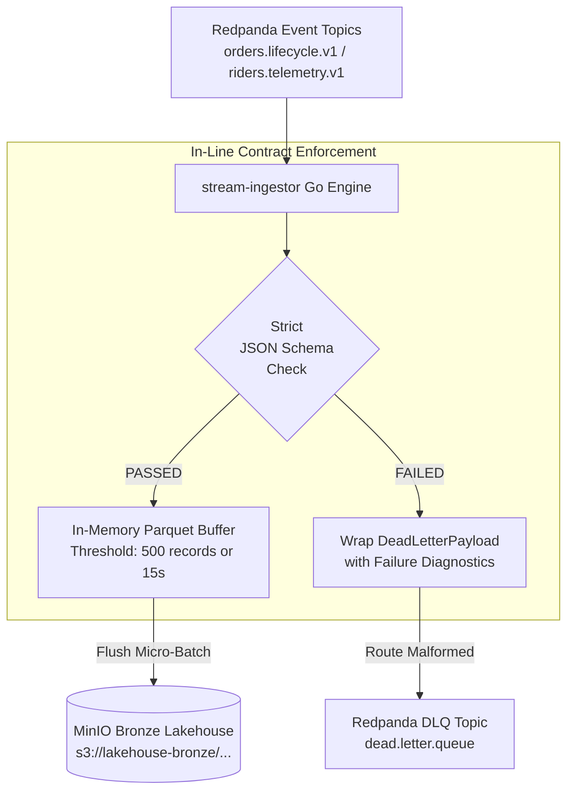

# Streaming: Ingestion, Schema Governance & Lakehouse Bronze

**Domain**: Real-Time Streaming & Storage Ingestion (`apps/stream-ingestor`)  
**Scope**: Redpanda Consumer, In-Line Contract Validation, Snappy Parquet Sinks & DLQ Routing  

---

## 1. High-Throughput Streaming Pipeline

The `stream-ingestor` Go microservice provides the high-performance bridge between real-time event logs in Redpanda and the columnar object storage lakehouse:

---

## 2. Ingestion Guarantees & Medallion Invariants

- **Zero Poison Pills**: A single corrupt or invalid message cannot break or halt the consumer stream. Violating events are isolated into `dead.letter.queue` with diagnostic error traces.
- **Columnar Snappy Parquet**: Valid events are micro-batched into Snappy-compressed Parquet files, structured into partitioned S3 paths:
  `s3://lakehouse-bronze/<domain>/date=YYYY-MM-DD/part-HHMMSS-<uuid>.parquet`
- **Backpressure & Flush Policy**:
  - Buffer flushes when **500 records** accumulate, OR
  - When **15 seconds** elapse (SLA freshness guarantee).

---

## 3. Metrics & Monitoring

- `events_ingested_total`: Total valid events written to Bronze S3.
- `schema_validation_failures_total`: Total rejected events routed to the DLQ.
- `parquet_flush_duration_seconds`: Latency of Parquet serialization and S3 PutObject.
